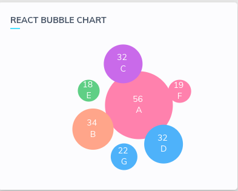

## React Bubbles with help of d3.js 

Still in development phase. (Currently working with the tooltips part)


To try out,

```
yarn add react-d3-bubbles # for yarn
npm i --save-dev react-d3-bubbles # for npm
```

And use in your component as 
```
import React from "react";
import ReactBubbleChart from "react-d3-bubbles";
const data = [
  {
    index: 0,
    name: "A",
    color: "#f48fb1",
    radius: 56
  },
  {
    index: 1,
    name: "B",
    color: "#ffab91",
    radius: 34
  },
  {
    index: 2,
    name: "C",
    color: "#b87fe9",
    radius: 32
  },
  {
    index: 3,
    name: "D",
    color: "#64b5f6",
    radius: 32
  },
  {
    index: 4,
    name: "E",
    color: "#81c784",
    radius: 18
  },
  {
    index: 5,
    name: "F",
    color: "#f48fb1",
    radius: 19
  },
  {
    index: 6,
    name: "G",
    color: "#64b5f6",
    radius: 22
  }
];

class Dashboard extends React.Component {
  render() {
    return (
      <div className="col-md-35 mb-20">
        <ReactBubbleChart data={data} />;
      </div>
    );
  }
}
export default Dashboard;
```
