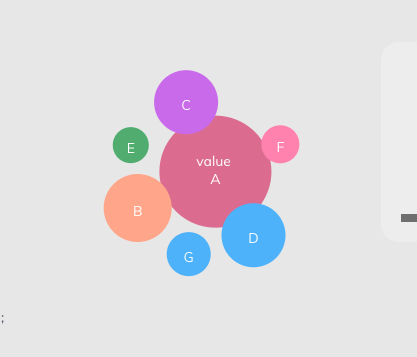

## React Bubbles with help of d3.js

Still in development phase. (Currently working with the tooltips part)


To try out,

```
yarn add react-d3-bubbles # for yarn
npm i --save-dev react-d3-bubbles # for npm
```

Currently supported props are:

```
# index is must for now. However, I am trying to remove the dependency on it.
# color should also be given, else the bubble will look black

data: [
  {
    index: 0,
    name: 'Overall',
    color: '#f48fb1',
    radius: 56,
    value: 56,
    tooltip: 'tooltip 0'
  }
]

# Note: Everything that you want to modify per bubble, has to be given inside data.

# Default props are:
  data: [
    {
      index: 0,
      name: 'A',
      value: '0',
      tooltip: 'A',
      color: '#f48fb1',
      radius: 56
    },
    {
      index: 1,
      name: 'B',
      value: '1',
      tooltip: 'B',
      color: '#ffab91',
      radius: 34
    },
    {
      index: 2,
      name: 'C',
      value: 2,
      tooltip: 'C',
      color: '#b87fe9',
      radius: 32
    },
    {
      index: 3,
      name: 'D',
      value: 3,
      tooltip: 'D',
      color: '#64b5f6',
      radius: 32
    },
    {
      index: 4,
      name: 'E',
      value: 4,
      tooltip: 'E',
      color: '#4dd0e1',
      radius: 31.5
    },
    {
      index: 5,
      name: 'F',
      value: 5,
      tooltip: 'F',
      color: '#f48fb1',
      radius: 31
    },
    {
      index: 6,
      name: 'G',
      value: 6,
      tooltip: 'G',
      color: '#81c784',
      radius: 28
    },
    {
      index: 7,
      name: 'H',
      value: 7,
      tooltip: 'H',
      color: '#f48fb1',
      radius: 24
    },
    {
      index: 8,
      name: 'I',
      value: 8,
      tooltip: 'I',
      color: '#64b5f6',
      radius: 32
    }
  ],
  width: 400,
  height: 250,
  center: { x: 200, y: 125 },
  forceStrength: 0.03
```

And use in your component as

```
import React from "react";
import ReactBubbleChart from "react-d3-bubbles";
const data = [
  {
    index: 0,
    name: "A",
    color: "#f48fb1",
    radius: 56
  },
  {
    index: 1,
    name: "B",
    color: "#ffab91",
    radius: 34
  },
  {
    index: 2,
    name: "C",
    color: "#b87fe9",
    radius: 32
  },
  {
    index: 3,
    name: "D",
    color: "#64b5f6",
    radius: 32
  },
  {
    index: 4,
    name: "E",
    color: "#81c784",
    radius: 18
  },
  {
    index: 5,
    name: "F",
    color: "#f48fb1",
    radius: 19
  },
  {
    index: 6,
    name: "G",
    color: "#64b5f6",
    radius: 22
  }
];

class Dashboard extends React.Component {
  render() {
    return (
      <div className="col-md-35 mb-20">
        <ReactBubbleChart data={data} />;
      </div>
    );
  }
}
export default Dashboard;
```

## Development

# To get started, clone the below repo and run the following commands:

```
# in this repo:

npm i
npm run build
npm link # npm link will be used to dev-test our component in our testing-project while we are developing it.

# in the test repo:

git clone git@github.com:absk1317/react-d3-bubbles-test.git # if not done already

npm install
npm link react-fancy-component
npm run start


# Now you can see the changes that you do in at http://localhost:3000
# Remember to do a `npm run build` everytime you change anything in the react bubbles repo
```
